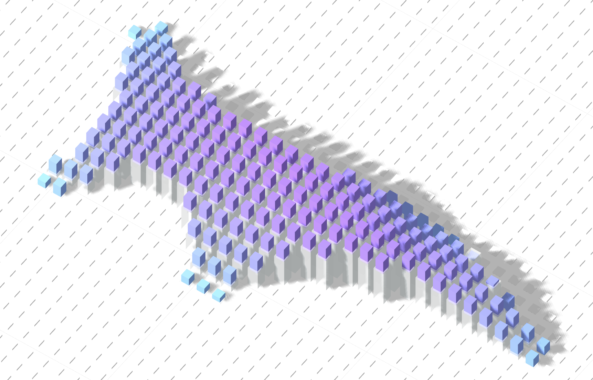
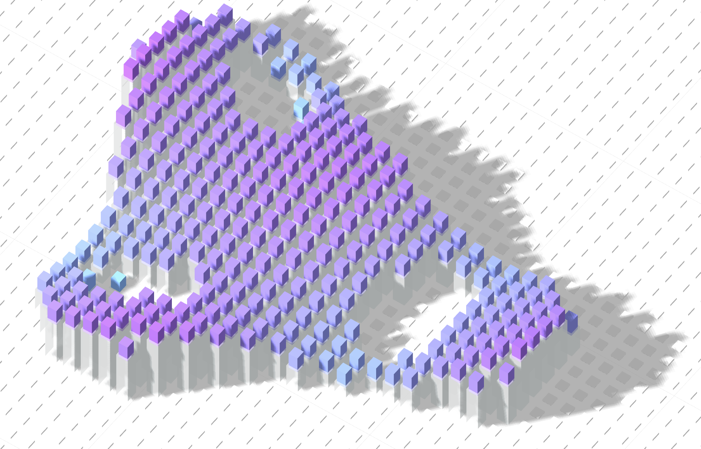

# Web Animation

Web Animation is a project that I have done in 2020, before I've learned how to code for the web.
It displays 3D models that I've done during my architect years. The goal was to find a fun way to browse between projects in my portfolio.

It uses Three.js as a lib for WebGL & GSAP for timeline animation uses.

## Getting Started

These instructions will get you a copy of the project up and running on your local machine for development and testing purposes. See deployment for notes on how to deploy the project on a live system.

### Prerequisites

- Install `yarn` from [here](https://classic.yarnpkg.com/fr/docs/install/#windows-stable)

### Installing

A step by step series of examples that tell you how to get a development env running

- Run `yarn global add parcel-bundler`

## Deployment

- Run `yarn start` to get a dev server
- Run `yarn build` to build the website
- Go to [localhost](http://localhost:1234/)

## Built With

- [Three.js](https://github.com/mrdoob/three.js/) - JavaScript 3D library
- [GSAP](https://greensock.com/) - Animation for the web
- [Lodash](https://lodash.com/) - Utility library for js

## What I've learned

- introduction to HTML, JS, Three.js and GSAP.
- 3D modeling, lights, camera, renderer, raycasting for the web.
- Create animations with mouse interactions.
- Find playfull ways to display 3D for the user.

## Screenshots

&nbsp;&nbsp;
